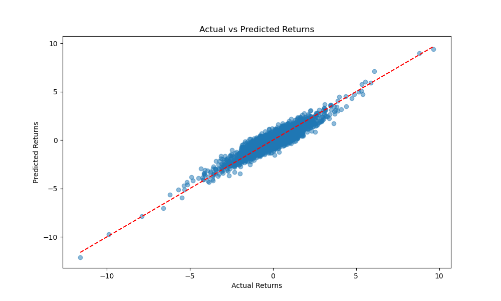

# Fama-French Three-Factor Model Implementation
This project provides a Python implementation of the [Fama-French three-factor model](https://www.bauer.uh.edu/rsusmel/phd/Fama-French_JFE93.pdf), which is a well-known asset pricing model in finance developed by Eugene Fama and Kenneth French. The model expands on the CAPM by adding size risk (SMB: Small Minus Big) and value risk (HML: High Minus Low) factors to the market risk factor.

## About the Fama-French Model
The Fama-French model includes three factors:
1. Market Factor (Mkt): Represents the excess return of a broad market portfolio over the risk-free rate.
2. Size Factor (SMB, Small Minus Big): Captures the additional returns expected from small-cap stocks over large-cap stocks.
3. Value Factor (HML, High Minus Low): Represents the excess returns of value stocks (high book-to-market ratio) over growth stocks (low book-to-market ratio).
This model is widely used to explain stock returns by these three risk factors, and is fundamental in the development of modern financial theory and practice.

## Mathematical Representation
The Fama-French model can be mathematically represented as follows:

$$
R_i - R_f = \alpha + \beta_{\text{mkt}}(R_m - R_f) + \beta_{\text{smb}}SMB + \beta_{\text{hml}}HML + \epsilon
$$

Where:
- $R_i$ is the return on the stock or portfolio.
- $R_f$ is the risk-free rate.
- $R_m$ is the return on the market portfolio.
- $\beta_{\text{mkt}}$, $\beta_{\text{smb}}$, and $\beta_{\text{hml}}$ are the sensitivities to the market, size, and value factors, respectively.
- $\alpha$ is the intercept, representing abnormal returns not explained by the model.
- $\epsilon$ is the error term.

## Output

```
                            OLS Regression Results                            
==============================================================================
Dep. Variable:                      y   R-squared:                       0.844
Model:                            OLS   Adj. R-squared:                  0.844
Method:                 Least Squares   F-statistic:                     6461.
Date:                Wed, 22 May 2024   Prob (F-statistic):               0.00
Time:                        09:01:38   Log-Likelihood:                -2524.0
No. Observations:                3583   AIC:                             5056.
Df Residuals:                    3579   BIC:                             5081.
Df Model:                           3                                         
Covariance Type:            nonrobust                                         
==============================================================================
                 coef    std err          t      P>|t|      [0.025      0.975]
------------------------------------------------------------------------------
const         -0.0166      0.008     -2.028      0.043      -0.033      -0.001
Market         1.0078      0.008    133.555      0.000       0.993       1.023
SMB            0.0156      0.014      1.124      0.261      -0.012       0.043
HML           -0.0049      0.010     -0.464      0.643      -0.025       0.016
==============================================================================
Omnibus:                        1.213   Durbin-Watson:                   1.984
Prob(Omnibus):                  0.545   Jarque-Bera (JB):                1.253
Skew:                           0.042   Prob(JB):                        0.534
Kurtosis:                       2.963   Cond. No.                         1.98
==============================================================================

Notes:
[1] Standard Errors assume that the covariance matrix of the errors is correctly specified.
```



## Links
* [Fama French Paper - "Common risk factors in the returns on stocks and bonds" (1992)](https://www.bauer.uh.edu/rsusmel/phd/Fama-French_JFE93.pdf)
* [**Learn Python for Trading Masterclass**](https://pythonfortraders.io/p/masterclass)
* [Our Homepage](https://pythonfortraders.io)
* [Connect with us on Twitter](https://twitter.com/PythonTraders)
